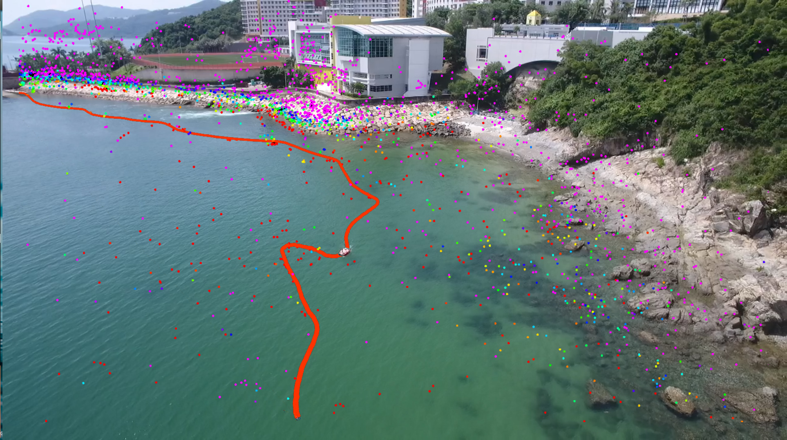
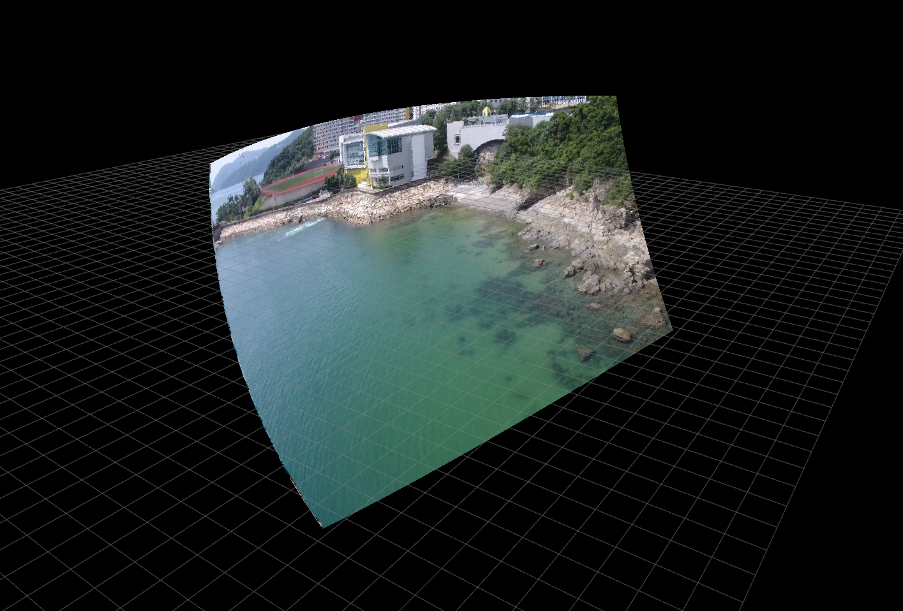

# rviz_hybrid_imshow:

`rviz_hybrid_imshow` is small tool to public a image as pointclouds. 

To shown the image in RIVZ as background.

A example:



**Authors:** [Wenlaing GAO](https://gaowenliang.github.io)

## Build

### Prerequisites

**ROS**

ROS on Ubuntu: [ROS Installation](http://wiki.ros.org/).


Other ROS pacakge requisites: special version [`camera_model`](https://github.com/gaowenliang/camera_model "camera_model"), [`code_utils`](https://github.com/gaowenliang/code_utils "code_utils").


## Run with your device 

### 1. camera intrinsic calibration

You can guess the intrinsic camera model, as shown in `config/p4.yaml`:

```
%YAML:1.0
---
model_type: PINHOLE
camera_name: p4
image_width: 1926
image_height: 1080
distortion_parameters:
   k1: 0.0
   k2: 0.0
   p1: 0.0
   p2: 0.0
projection_parameters:
   fx: 1166
   fy: 1166
   cx: 963
   cy: 540
```

### 2. Modify your launch file
As shown in `launch/p4.launch`:

* scale:  distance of the background, m
* yaw:    yaw of the camera, degree
* pitch:  pitch of the camera, degree
* roll:   roll of the camera, degree
* tx:     x position of the camera, m
* ty:     y position of the camera, m
* tz:     z position of the camera, m


### 3. Launch your launch file
Launch your launch file, and subscribe the topic `/rviz_hybrid_imshow/Pont`. Then you get:



change the View Type as: `FPS(rviz)`, and change the Position of the camera same as the position in launch file.

Get:


have fun.
